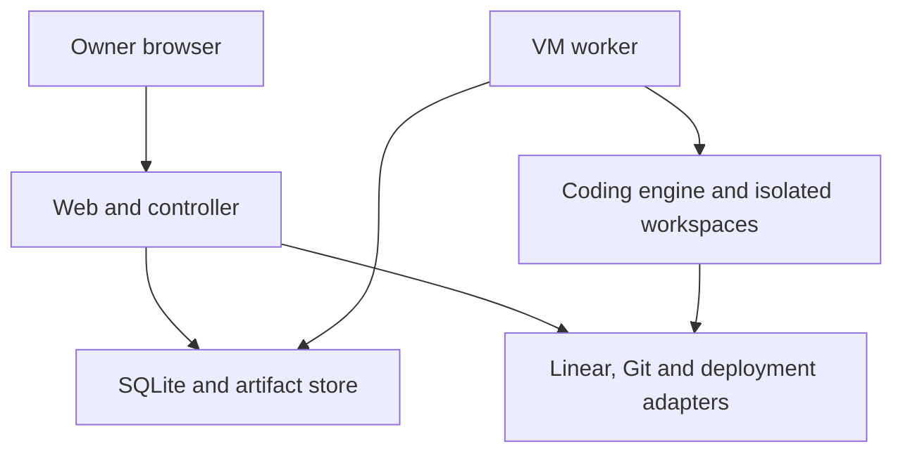

# ShipLoop architecture

Status: target design for the MVP. Only repository verification tooling exists today.
[MVP acceptance criteria](docs/product/mvp-spec.md) are the scope authority.
[ADR 0001](docs/decisions/0001-web-control-plane-and-vm-worker.md) records the deployment choice.

## Deployment and responsibilities

One responsive web app controls work from desktop/mobile browsers. A persistent service
on the VM continues after a browser disconnects. No native client is required initially.

Prefer a TypeScript monorepo with React/Next.js for web, a TypeScript controller,
and a persistent TypeScript worker. Next.js server routes may host controller endpoints;
the worker must not live inside request handlers. Use pnpm workspaces when the first
actual packages are introduced. Avoid Redis, Kubernetes, and a second orchestrator
until a demonstrated requirement needs them.

Planned package responsibilities (directories are not implemented yet):

| Package | Owns | Must not own |
| --- | --- | --- |
| apps/web | Owner UI, authentication boundary, thin HTTP handlers | Child process lifetime or cached release authority |
| apps/worker | Durable job claiming, engine processes, verification, checkpoints | Self-approval or production credentials |
| packages/domain | State transitions, candidate identity, policy evaluation | Provider SDKs, browser code, filesystem I/O |
| packages/storage | SQLite schema, migrations, atomic operations, backups | Remote side effects inside transactions |
| packages/adapters | Linear/Git/deployment/engine contracts and translations | A competing ticket database or lifecycle policy |
| packages/controller | API use cases, reconciliation, privileged operations | Unbounded model-driven decisions |
| packages/verification | Environment recipes, checks, evidence, owned cleanup | Assuming a worktree isolates services |

These are responsibility boundaries, not a requirement for six new packages on day one.
The first slice may colocate modules while keeping import boundaries clear.

## Authority and durable state

Linear owns published ticket scope; Git owns code/PR facts; deployment providers own
deployment identities. ShipLoop owns draft clarification, versioned profiles/procedures,
immutable scope snapshots, attempts, evidence, owner decisions, and release receipts.
A web read model can cache facts, but decisions re-fetch relevant live provider state.

Use SQLite on local VM storage, with WAL, bounded transactions, foreign keys and
versioned migrations. A transaction claims one global coding slot and records an
operation identity before work. Plan asynchronous work outside transactions, then
re-read authoritative rows before writing. Artifacts are named files referenced by
rows, not an alternative authoritative state store. Back up a consistent SQLite
snapshot plus referenced artifacts; restore verification belongs in the storage slice.

Suggested entities: ProjectProfileVersion, ProcedureVersion, WorkItemLink,
ScopeSnapshot, Attempt, WorkspaceLease, Candidate, CheckResult, Evidence,
OwnerDecision, ExternalOperation, ReleaseReceipt, InboxEvent, OutboxEvent.
Define actual schemas with their slice, not speculative empty tables.

## Execution and recovery

One owner and one active coding writer globally for the pilot. Persist claim/heartbeat/
checkpoint ownership. A lease expiring does not prove the process stopped. Reconcile
the old writer before granting another writer access to the same workspace.

An attempt uses a dedicated Git worktree plus its own data directory, ports, browser
storage and process registry. A worktree alone does not isolate processes/databases.
Read the connected repository's instructions. Store ShipLoop recipes and coordination
data outside that repository; ordinary application code/tests may be changed there.

Provider adapters expose capabilities explicitly. First adapters: Linear, GitHub,
one selected deployment provider, Codex structured execution (subject to a real VM
compatibility spike). T3 Code initially receives a context packet/manual handoff;
do not assume it has a stable session-control API. Hermes is optional, not required.

Jobs use durable records and a transactional outbox, not a new external queue.
Events have correlation IDs and deduplication keys. Reconcile on startup and on a
bounded schedule; webhooks are hints, not sufficient proof of current state.

Each external write has a stable operation ID, target identity, expected refs and
recorded outcome. A lost response becomes Outcome unknown. Read provider facts
before deciding whether retry is safe; retries must not create duplicate tickets,
PRs, merges, or deployments. Use provider compare-and-set/expected-head protection
when offered; otherwise state the race limitation and recheck immediately.

## Candidate and decision rules

Keep attempt execution, product acceptance and delivery as separate dimensions.
A Completed attempt does not mean Accepted, Merged or Released.

A candidate identity includes full head/base SHAs, scope revision, profile/procedure
versions, environment fingerprint, relevant component identities and deployment ID.
Changed inputs invalidate affected evidence and decisions. Never reuse approval for
a replacement build simply because the PR number is unchanged.

The coding worker can propose changes and collect proof. Only the owner can accept
product behavior and authorize merge/release. A production-triggering merge requires
authorization before merge. Coding credentials cannot deploy to production.
After authorized delivery, record actual merge/deployment IDs and a live smoke result.

## Interfaces to establish with each slice

- Commands validate input and return typed results, including Blocked and Outcome unknown.
- The minimal-MVP review path (verification sources, evidence binding, criterion states,
  readiness gates and owner decisions) has one contract, stated in
  [MVP review contract](docs/product/mvp-review.md).
- Engine adapters translate native output into progress/checkpoint/result events.
  Protocol versions and runtime compatibility are tested at the boundary.
- Verification results distinguish Passed, Failed, Missing, Waiting, Stale and
  policy-approved Not applicable. Agent text cannot mutate these into Passed.
- API state changes include current revision/candidate identity. Reject stale requests.
- Read models expose attention and next actions; do not run an LLM on every webhook.
- Bound output/context packets, subprocess duration, retries, artifact retention,
  event reconciliation and resource use. Human wait time is separate from active budgets.

## Build order and exit proof

| Slice | Smallest useful result | Exit proof |
| --- | --- | --- |
| 0 — This foundation | Shared instructions and bounded local verification | Tooling tests, document/config checks, honest blocked app profile |
| A — Setup | Owner sign-in, profiles, credentials, recipe/preflight | Two isolated profiles; fresh VM setup; inaccessible private API without auth |
| B — Scope | Intake, clarification, Linear publishing/readiness | One idea becomes versioned criteria and one deduplicated ticket |
| C — Execution | Durable worker, worktree, progress, checkpoint, draft PR | Browser close/restart preserves job; cancellation stops owned writer |
| D — Verification | Checks, preview identity, review/fix and evidence | Agent demonstrates real flow; stale candidate cannot retain evidence |
| E — Delivery | Owner test/accept, current authorization, merge/release receipt | Changed head rejected; unknown writes reconciled; deployed commit verified |
| F — Operations | Backups, restore, retention and portability | Restore drill and a second project recipe; report actual host support |

Map implementation tickets/tests to the spec's criteria. Select a disposable pilot and
deployment provider before live writes. Migrate SQLite to Postgres only when multi-host
coordination or measured contention justifies that decision.
