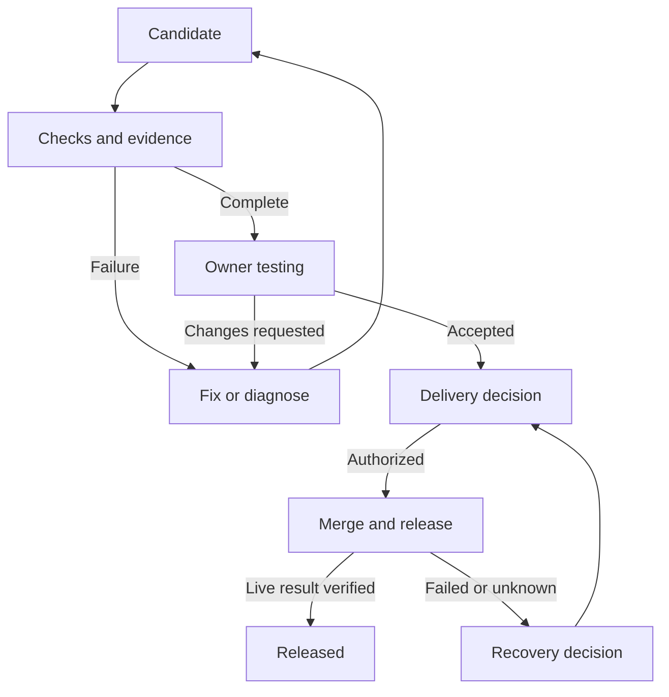

# ShipLoop — MVP specification v0.1

Date: 30 September 2026. Working product name: ShipLoop.

Status: implementation specification based on the current conversation, the Linear workflow revision, the Devin addendum, and the primary sources below. No application, repository, issue, or deployment was changed while preparing this specification. Recommendations and unresolved compatibility checks are explicitly distinguished from verified vendor capabilities.

## 1. Problem statement

The owner manages several projects through SSH, an Oracle VM, Codex/ChatGPT Work, T3 Code, Linear, Git hosting, and deployment services. Turning an idea into shipped work requires repeated explanations, manual context transfer, environment preparation, progress tracking, preview discovery, testing, and release checks. Work can appear complete even when the owner has not accepted it or the production release has not succeeded.

ShipLoop should reduce those handoffs and preserve continuity. It must make the current scope, running work, tested version, missing evidence, owner decision, and delivery result easy to understand.

## 2. Solution and product boundary

A standalone web application coordinates idea → clarified brief → plan → Linear work → VM execution → linked PR/MR → checks and preview → owner testing → approved delivery → confirmed release.

The product has its own repository, application, database, project profiles, procedure versions, and artifacts. It does not require ShipLoop configuration or an installed product inside connected application repositories. Ordinary application code and meaningful tests can still be changed there. Existing repository instructions are read when relevant.

The browser is the control surface. The VM service performs the work and continues when the browser or laptop is closed. T3 Code remains useful alongside ShipLoop; the MVP does not replace the editor or promise direct control of T3 threads.

### First-release scope

- One owner, one authenticated workspace, multiple saved project profiles, and one active coding run globally.
- Linear as the first ticket provider; one Git provider and one deployment provider implemented for the pilot.
- Codex CLI with structured output as the recommended initial execution interface, subject to a compatibility/authentication spike on the actual VM. A supported SDK can replace that interface without changing lifecycle behavior.
- Recommended first pilot: a small EGA House change. This is a proposal; the exact issue and deployment provider must be selected and verified before live execution.
- GitHub is the proposed first Git adapter for that pilot. GitLab/Gymtrack is the subsequent portability milestone, rather than a second mandatory integration for first release.
- Web-first verification: browser evidence for UI work and request/result evidence for API work.
- No mandatory additional agent or orchestration subscription. Existing service costs and quotas remain applicable.

The 32 MVP capabilities below are acceptance boundaries, not 32 separate services or a promise that each requires a separate ticket. They are delivered in a few vertical slices. All F01–F32 and N01–N08 are required for the v0.1 release; L01–L12 are deferred.

## 3. Ownership, vocabulary, and lifecycle

| Information | Authoritative owner | ShipLoop behavior |
|---|---|---|
| Raw idea and unpublished clarification | ShipLoop | Persist drafts and decisions |
| Published issue scope, criteria, priority, dependencies | Linear | Read live content and retain immutable run snapshots |
| Code, commits, PR/MR review and merge facts | Git provider | Link, fetch, and reconcile actual state |
| Preview/deployment identity and provider result | Deployment provider | Match to the intended candidate and destination |
| Runs, evidence, acceptance and release decisions | ShipLoop | Persist and enforce lifecycle conditions |
| Procedure and project-profile versions | ShipLoop | Keep inspectable provenance and apply the selected version |

Definitions:

- **Work item:** linked published issue; it is not a second editable backlog record.
- **Attempt:** one bounded execution or verification effort against a captured scope.
- **Candidate:** code and artifacts proposed for testing/delivery, identified by full commit and relevant component identities.
- **Evidence:** observed check/test result with candidate, environment, time, and artifact references.
- **Acceptance:** an owner's decision about a specific candidate and scope revision.
- **Authorization:** an owner's permission for a particular merge, release, or recovery action; acceptance alone is not authorization.
- **Release receipt:** confirmed delivery identities and live verification, linked to work and decisions.

Maintain three independent state dimensions:

| Dimension | States |
|---|---|
| Attempt execution | Queued, Preparing, Running, Verifying, Waiting for owner, Paused, Blocked, Completed, Cancelled |
| Product acceptance | Not requested, Pending, Changes requested, Accepted, Stale |
| Delivery | Not authorized, Authorized, Merging, Merged, Releasing, Released, Failed, Outcome unknown |

A completed attempt does not imply acceptance or release. After a timeout, Outcome unknown is used until provider reconciliation establishes whether an external action happened. Cancelled means execution has stopped; cancellation does not discard code or revert external effects.

New code, relevant scope, base branch, environment configuration, required policy, or replacement deployment makes affected evidence/acceptance stale. Historical records remain visible. A changed candidate cannot inherit an authorization silently.

## 4. End-to-end user journey

1. Select a project and capture an idea, or select an existing Linear issue.
2. Inspect relevant context, clarify only material unknowns, and create a short brief with observable criteria.
3. Propose the smallest useful plan. Publish agreed issues or work from the existing issue.
4. Check readiness. The owner presses Start work for a scoped, bounded run.
5. Prepare an isolated workspace and environment on the VM. Implement and open a linked draft PR/MR after a meaningful commit.
6. Collect current checks, run a review/fix pass, identify the correct preview, and demonstrate the main acceptance flow.
7. Show one review card. The owner tests, accepts, requests changes, or pauses.
8. Check live provider facts and request the applicable delivery authorization. A production-triggering merge requires approval before that merge.
9. Confirm the deployed/artifact identity and the configured live smoke result. Record a release receipt and synchronize the supported completion state to Linear.

Start work authorizes normal scoped implementation, verification, and configured progress publication. Routine reversible steps do not require repeated approval. Material scope expansion, merge, production publication, and recovery remain explicit owner decisions.

## 5. MVP user stories, feature catalog, and acceptance criteria

Each criterion has a stable ID for implementation tickets, tests, and release evidence. Dependencies indicate prerequisites, not a rigid chronological execution order.

### F01 — Owner access and web workspace

**Story:** As the owner, I want private access from desktop or mobile browser so I can supervise work from either device.

**Dependencies:** none. **Slice:** A.

- **F01-AC1:** An unauthenticated request cannot read private ideas, profiles, run details, artifacts, or invoke owner actions; it receives a sign-in response or an authorization error.
- **F01-AC2:** One provisioned owner can sign in, refresh, and sign out; signing out prevents subsequent privileged requests using that session.
- **F01-AC3:** Intake, attention list, review card, and approval controls remain usable at 375px and 1280px viewport widths without horizontal scrolling of the main page.
- **F01-AC4:** State-changing browser requests are protected against cross-site request forgery; authentication cookies are secure and unavailable to client-side scripts where cookie sessions are used.
- **F01-AC5:** Installing a native desktop/mobile application is not required to complete the pilot journey. Offline clients show their disconnected state and cannot authorize delivery from cached facts.

### F02 — Independent project profiles

**Story:** As the owner, I want separate project configurations so an agent uses the right repository, environment, and release path.

**Dependencies:** F01. **Slice:** A.

- **F02-AC1:** Save at least two profiles containing repository/provider identity, Linear mapping, target branch, workspace policy, checks, preview components, and delivery behavior.
- **F02-AC2:** Switching profiles changes the context and connector targets of new work; no run can silently use another project's repository or environment.
- **F02-AC3:** Profiles are versioned in ShipLoop storage; a run references its selected version and displays subsequent relevant changes.
- **F02-AC4:** Missing required fields or unsupported provider capabilities produce field-specific errors and prevent affected operations.
- **F02-AC5:** Onboarding a project does not create ShipLoop configuration files or install ShipLoop inside its application repository.

### F03 — Connector setup, credentials, and capability checks

**Story:** As the owner, I want to know what each connection can do so failed access is identified before work starts.

**Dependencies:** F01, F02. **Slice:** A.

- **F03-AC1:** Configure Linear, the implemented Git provider, deployment provider, and engine references; test access to the selected project resources.
- **F03-AC2:** Display connection status, last checked time, supported read/write capabilities, and a useful error for expired or missing access.
- **F03-AC3:** Store credential references separately from profile text; secret values are absent from UI responses, exported context, issue comments, and normal logs.
- **F03-AC4:** Revocation blocks new affected operations. A running attempt preserves its work and reports the access blocker rather than repeatedly retrying credentials.
- **F03-AC5:** Connection alone does not grant merge/release authority; the coding role receives no production deployment credential and no unrestricted release tool.

### F04 — Reusable environment recipe and preflight

**Story:** As the owner, I want project setup remembered and verified so every task does not rediscover how to run the application.

**Dependencies:** F02, F03. **Slice:** A.

- **F04-AC1:** A versioned recipe records runtime/CPU requirements, dependency install, service startup, check commands, isolated ports/data, and test-access references.
- **F04-AC2:** Before implementation, verify repository access, runtime compatibility, dependencies, and required services; persist actual outputs and exit results.
- **F04-AC3:** A missing runtime, unavailable test service, or missing required secret returns Blocked with the failed prerequisite; implementation is not reported as started successfully.
- **F04-AC4:** Dependency changes in current code trigger the configured maintenance step or an explicit incompatibility result; old successful setup is not reused blindly.
- **F04-AC5:** The recipe works in the VM pilot after fresh workspace preparation; environment resources are cleaned up without deleting retained work or shared project data.

### F05 — Project facts and versioned procedures

**Story:** As the owner, I want reusable context and procedures so I can explain a project once and inspect what the agent receives.

**Dependencies:** F02. **Slice:** A.

- **F05-AC1:** Store a compact project map, decisions, and procedures with source, scope, version, and last verification time/revision.
- **F05-AC2:** Build a viewable context packet containing the current ticket snapshot, relevant facts/procedures, repository guidance, and prior feedback; unrelated project context is excluded.
- **F05-AC3:** Contradictory live facts supersede stale remembered facts and expose the discrepancy; a memory note cannot silently override current scope or access policy.
- **F05-AC4:** Proposed procedure improvements require an owner save action and a new version; they do not modify instructions for future runs automatically.
- **F05-AC5:** Invalid structured outputs are rejected with a recoverable error; only validated proposals enter the lifecycle, and model text cannot directly set acceptance or release state.

### F06 — Idea and bug intake

**Story:** As the owner, I want to capture a rough request quickly so I do not lose it before it becomes actionable work.

**Dependencies:** F01, F02. **Slice:** B.

- **F06-AC1:** Capture raw text, optional project, notes, and supported text/image attachments; the saved raw request remains distinct from generated summaries.
- **F06-AC2:** Saved drafts survive refresh and service restart; a failed save is clearly reported and does not falsely display Saved.
- **F06-AC3:** Intake supports a feature request or a bug with expected/actual behavior and reproduction details when available; missing optional fields do not prevent capture.
- **F06-AC4:** Before publication, show potentially related Linear work and allow link, extend, or create new; resemblance alone never auto-merges or discards an idea.
- **F06-AC5:** An owner can defer/archive an unpublished idea without creating a Linear issue or consuming a coding run.

### F07 — Clarification and concise brief

**Story:** As the owner, I want help turning my request into clear behavior so the agent builds what I mean.

**Dependencies:** F05, F06; existing-issue entry can use F11. **Slice:** B.

- **F07-AC1:** Generate a brief containing problem, desired outcome, included/excluded behavior, assumptions, acceptance criteria, and unresolved questions.
- **F07-AC2:** Ask targeted questions only for material ambiguity; a supplied complete request can produce a brief without a mandatory interview.
- **F07-AC3:** Owner corrections remain in the conversation and update the proposed brief; the raw request and prior decisions stay accessible.
- **F07-AC4:** Code-grounded claims identify the inspected repository revision and relevant evidence; unavailable context is labelled unknown rather than invented.
- **F07-AC5:** Clarification uses a read-only capability profile and does not change application code, publish tickets, or deploy as a side effect.

### F08 — Implementation plan and dependent task proposals

**Story:** As the owner, I want a small executable plan so I can see how the outcome will be delivered.

**Dependencies:** F07. **Slice:** B.

- **F08-AC1:** Produce proposed tasks with outcome, scope, acceptance criteria, verification method, dependencies, and relevant project context.
- **F08-AC2:** A small change can remain one issue; splitting is justified by independently reviewable behavior or a real dependency.
- **F08-AC3:** Before publication, the owner can edit, remove, reorder, and combine proposals; unaccepted proposals do not become external tickets.
- **F08-AC4:** Detect cyclic/unresolved dependencies and prevent declaring the affected task ready; dependencies are visible in the proposed order.
- **F08-AC5:** Every requested outcome is covered by a proposed task or an explicit exclusion; implementation locations are treated as proposals rather than unsupported certainty.

### F09 — Readiness diagnosis

**Story:** As the owner, I want to know whether work can start so the agent does not waste a session on missing prerequisites.

**Dependencies:** F04, F05, F08 or F11. **Slice:** B.

- **F09-AC1:** Return Ready, Needs information, or Blocked, with reasons for scope, criteria, repository/target, dependencies, verification, and required access.
- **F09-AC2:** Build is disabled when a required prerequisite is absent; supported read-only investigation can still be started to resolve uncertainty.
- **F09-AC3:** A referenced dependency marked Done but missing required delivery evidence is not automatically treated as available when the work actually needs its release.
- **F09-AC4:** When prerequisites change, a new assessment records what changed; readiness is not a permanent boolean or an unsupported percentage confidence score.
- **F09-AC5:** A complete, accessible, unblocked small task becomes Ready without unnecessary questions or fabricated blockers.

### F10 — Publish agreed work to Linear

**Story:** As the owner, I want agreed tickets in Linear so my backlog stays in one place.

**Dependencies:** F03, F08. **Slice:** B.

- **F10-AC1:** Create issues only after Create tickets is selected, with agreed title, scope, criteria, project/team, and supported dependency/parent links.
- **F10-AC2:** Save external IDs and URLs and expose publication success per proposed ticket; a partial failure identifies what remains unpublished.
- **F10-AC3:** Repeating the same publication request after a timeout reconciles existing external work and does not create duplicate issues.
- **F10-AC4:** Published fields are edited through Linear or a deliberate proposed Linear update; ShipLoop does not maintain a second independently editable live ticket.
- **F10-AC5:** Permission/capacity errors preserve the proposal, show a useful explanation, and allow retry after correction without losing successful mappings.

### F11 — Adopt existing issues, branches, and PRs

**Story:** As the owner, I want to continue existing work so I do not recreate it to use ShipLoop.

**Dependencies:** F02, F03. **Slice:** B.

- **F11-AC1:** Select an accessible Linear issue and load its live description, criteria, priority, dependencies, and links without creating a replacement.
- **F11-AC2:** Link a compatible existing branch/PR when explicitly selected; verify repository, head, and target before adoption.
- **F11-AC3:** Wrong-project, inaccessible, or ambiguous mappings are rejected with a reason; the system never picks a similarly named repository silently.
- **F11-AC4:** Preserve existing code and discussion; human-authored branches or uncommitted work are not reset to a generated starting point.
- **F11-AC5:** Test or Review can be requested for an adopted candidate without launching a Build job or rewriting the original issue.

### F12 — Scope snapshots and external changes

**Story:** As the owner, I want changes to requirements detected so work does not silently expand or ship against outdated criteria.

**Dependencies:** F10 or F11. **Slice:** C.

- **F12-AC1:** Starting a run captures the issue content, semantic scope fingerprint, retrieval time, and selected project/procedure versions.
- **F12-AC2:** A material criteria/scope edit is shown as a difference and blocks acceptance/delivery until reconciled; unaffected bounded work may continue.
- **F12-AC3:** A priority or cosmetic edit alone does not restart coding or erase an existing acceptance decision.
- **F12-AC4:** Reconciliation allows adopting the revised scope, keeping work pending clarification, or proposing a follow-up issue; it records the owner choice.
- **F12-AC5:** Synchronization never silently restores an older description over a manual edit or treats an external Done status as release confirmation.

### F13 — Explicit job start and durable queue

**Story:** As the owner, I want bounded work to run in the background so progress does not depend on an open laptop.

**Dependencies:** F09, F12. **Slice:** C.

- **F13-AC1:** Start work records mode, scope snapshot, project, limits, permitted operations, and a durable job before returning success.
- **F13-AC2:** Repeated start requests with the same operation identity produce one job; starting another task queues it while the global coding slot is occupied.
- **F13-AC3:** Jobs can use Plan/Investigate, Build, Test, or Review modes with their declared capabilities; no mode implies merge/release authorization.
- **F13-AC4:** A running job continues after browser disconnect; queued jobs and status survive service restart.
- **F13-AC5:** Ordinary Linear/webhook updates do not launch new coding jobs automatically; the initial dispatch requires the recorded owner start action.

### F14 — Isolated workspace and resource ownership

**Story:** As the owner, I want task work separated from other work so an agent does not overwrite my current project state.

**Dependencies:** F04, F13. **Slice:** C.

- **F14-AC1:** Prepare a task workspace from the recorded repository/base, with a linked branch and a lock identifying its active owner.
- **F14-AC2:** Existing unrelated worktrees and uncommitted changes are untouched; adoption preserves explicitly selected work.
- **F14-AC3:** Task services use configured isolated ports and test-data resources; a collision produces a blocker rather than attaching to an unrelated service.
- **F14-AC4:** Before resuming/reusing a workspace, compare actual files/head and retained checkpoint; unexpected human changes are shown and reconciled.
- **F14-AC5:** Cleanup stops only owned processes and removes only eligible temporary resources. Work/evidence retained for recovery cannot be deleted by ordinary cancellation.

### F15 — Supported coding-engine adapter

**Story:** As the owner, I want my existing coding engine to execute the task so ShipLoop does not force another agent purchase.

**Dependencies:** F03, F05, F14. **Slice:** C.

- **F15-AC1:** The verified adapter starts a scoped session in the correct workspace and retains engine version, mode, session reference, and structured events when available.
- **F15-AC2:** Parse success, failure, output artifacts, and usage only when reported by the engine; malformed output does not become a successful completion.
- **F15-AC3:** Missing authentication, unavailable model, quota exhaustion, or unsupported runtime returns an actionable blocked result and preserves the workspace.
- **F15-AC4:** Validate start, stop, and supported resume on the actual VM/CPU/version before the pilot; unsupported internal conversation restoration uses a fresh session with the checkpoint.
- **F15-AC5:** ShipLoop does not copy browser credentials or silently switch billing/accounts. A different paid authentication path requires a deliberate owner configuration choice.

### F16 — Run progress and concise external updates

**Story:** As the owner, I want to understand progress and blockers without reading every tool call.

**Dependencies:** F13, F15. **Slice:** C.

- **F16-AC1:** Display stage, latest milestone, elapsed time, blocker, next action, and detailed logs/evidence accessible on demand.
- **F16-AC2:** Publish configured meaningful progress to the linked issue and managed PR section; edits preserve human discussion and unmanaged content.
- **F16-AC3:** Repeated milestone delivery does not produce duplicate comments; use an updatable managed comment where the verified provider allows it.
- **F16-AC4:** A failed external update is labelled Pending sync with last success time and retry status; local run progress remains available.
- **F16-AC5:** Routine output stays in the run view; requests for input, test readiness, delivery decisions, and failed release remain visible attention items.

### F17 — Pause, cancellation, checkpoint, and resume

**Story:** As the owner, I want to interrupt and continue work safely so I can take over or recover after a restart.

**Dependencies:** F13, F14, F15. **Slice:** C.

- **F17-AC1:** Pause stops new stage/tool dispatch and attempts graceful engine shutdown; Paused is shown only after the writer is stopped or safely detached under the verified adapter policy.
- **F17-AC2:** Persist scope, versions, workspace, full code identity, dirty/untracked work inventory, results, feedback, blocker, and next action.
- **F17-AC3:** Resume checks the actual workspace and live external state before continuing; it never repeats a merge/deployment solely because a prior response was lost.
- **F17-AC4:** Cancel prevents future coding dispatch and preserves work/history. An already-started external delivery remains reconciled and is not presented as undone.
- **F17-AC5:** After worker interruption, establish whether an old process is still writing before reclaiming its job; a lease timeout alone cannot authorize a second writer.

### F18 — Failure diagnosis and bounded attempts

**Story:** As the owner, I want understandable failures and limited retries so an agent does not loop indefinitely.

**Dependencies:** F13, F15, F17. **Slice:** C.

- **F18-AC1:** A failure records stage, observed error/evidence, category, attempted remedy, and a recommended next action.
- **F18-AC2:** Initial configurable defaults are 60 minutes of active execution per attempt and at most two automated code-fix passes; reaching a limit checkpoints work and waits for an owner extension.
- **F18-AC3:** Required owner waits do not consume active execution time; tool/network retries use separate bounded limits rather than restarting all coding work.
- **F18-AC4:** Report provider usage when available, and Unknown when absent; do not invent token counts, remaining subscription quota, or costs.
- **F18-AC5:** Deterministic scope/authentication failures are not blindly retried. A proposed learned procedure change is inspectable and follows F05 ownership.

### F19 — Early linked draft PR/MR

**Story:** As the owner, I want visible code progress linked to its ticket so work is reviewable before the agent finishes.

**Dependencies:** F11 or F10, F14, F15. **Slice:** C.

- **F19-AC1:** After a meaningful commit and successful push, create or update one linked draft using the configured repository and target branch.
- **F19-AC2:** Include purpose, scope, criteria checklist, known gaps, and current verification summary without claiming unexecuted checks passed.
- **F19-AC3:** Persist branch, PR/MR external identity, base/target, and full head commit; reconcile a lost create response before retrying.
- **F19-AC4:** Use the provider's supported Linear linking mechanism. Inaccessible push or PR rights are an explicit blocker, not a false PR-created milestone.
- **F19-AC5:** Do not open a fabricated code change solely to create a PR. Read-only/no-change jobs can complete with evidence and a stated no-code outcome.

### F20 — Check results and freshness

**Story:** As the owner, I want real verification results for the current candidate so old green checks cannot approve new code.

**Dependencies:** F04, F19. **Slice:** D.

- **F20-AC1:** Execute configured local checks and read required provider CI results, retaining check identity, candidate, start/end time, exit/status, and output references.
- **F20-AC2:** Represent Passed, Failed, Missing, Waiting, Stale, and explicitly Not applicable; skipped required checks are not Passed.
- **F20-AC3:** Head/base or relevant environment/policy changes invalidate affected results and prevent ready-for-delivery until the applicable checks rerun.
- **F20-AC4:** Distinguish a confirmed base failure from a change-introduced failure when evidence allows; an existing failure does not automatically waive a required check.
- **F20-AC5:** Required checks and who can change the policy are explicit in the project profile; the coding agent cannot remove a required gate to pass its own work.

### F21 — Review and fix loop

**Story:** As the owner, I want the implementation examined before testing so obvious defects and missed scope are caught early.

**Dependencies:** F18, F19, F20. **Slice:** D.

- **F21-AC1:** Run a fresh review context using accepted scope, current diff, relevant neighboring code, project rules, and actual checks.
- **F21-AC2:** Findings contain location, reason, severity, and proposed verification; a possible issue is distinguished from a reproduced defect.
- **F21-AC3:** Relevant fixes stay in the linked branch and rerun affected checks/evidence; material new work is proposed separately.
- **F21-AC4:** Unresolved required findings block readiness; an owner disposition is recorded without fabricating provider-required approval.
- **F21-AC5:** Enforce the configured attempt limits. Describe same-engine fresh-context review accurately; it is not advertised as independent human/model approval.

### F22 — Preview discovery and access

**Story:** As the owner, I want the correct preview and access instructions so I can test the version under review.

**Dependencies:** F03, F19, F20. **Slice:** D.

- **F22-AC1:** Match a provider deployment to repository, full commit, component, and preview environment; retain its ID and deployment-specific URL.
- **F22-AC2:** A branch alias can be a convenience link but does not establish tested identity. Older or wrong-environment deployments are labelled Stale/ineligible.
- **F22-AC3:** Missing, building, failed, protected, and usable preview states are distinct; a protected sign-in page is not successful application verification.
- **F22-AC4:** For a profile with web and API components, show both identities and confirm the preview web connects to the intended API/test environment.
- **F22-AC5:** Expired/removed deployments can be rebuilt or selected again with a new identity; affected acceptance is invalidated instead of silently redirecting old evidence.

### F23 — Acceptance evidence pack

**Story:** As the owner, I want a demonstration of actual behavior so I can judge the result quickly.

**Dependencies:** F20, F22. **Slice:** D.

- **F23-AC1:** Assign each applicable criterion an automated or owner-test verification method and record a verified result, Pending owner test, or an explicit untested/missing result; generic green CI does not claim every criterion is satisfied.
- **F23-AC2:** For the main UI flow, retain at least a meaningful screenshot and observed outcome; for API work, retain a sanitized request/result or equivalent behavior evidence.
- **F23-AC3:** Evidence records scope revision, full commit, deployment/component IDs where applicable, environment, time, and execution method.
- **F23-AC4:** Local evidence is labelled local. Preview acceptance criteria requiring deployed behavior remain unmet until observed against the eligible preview.
- **F23-AC5:** A capture failure and a behavior failure are distinct. Traces/recordings are optional enhancements and remain owner-private when they include test-session data.

### F24 — Unified review card

**Story:** As the owner, I want one place to review work so I do not assemble the ticket, PR, checks and preview manually.

**Dependencies:** F12, F16, F21, F22, F23. **Slice:** D.

- **F24-AC1:** Show linked issue/scope, PR/diff link, candidate identity, criteria results, required checks, preview, evidence, remaining gaps, and simple owner test steps.
- **F24-AC2:** Accept, Request changes, Pause, and the applicable delivery decision are visible only when their current prerequisites allow them.
- **F24-AC3:** Missing/stale required automated evidence prevents Ready for your test under the selected policy. Owner-test criteria may remain Pending owner test at that stage; they must be satisfied before Accepted. Incomplete work remains inspectable with reasons.
- **F24-AC4:** Refresh or live updates expose a new candidate and invalidate old eligibility; actions submitted from an outdated card receive a conflict and show current facts.
- **F24-AC5:** Provider links open the correct accessible artifact; unavailable content shows an access/freshness error rather than an empty success panel.

### F25 — Owner acceptance and feedback

**Story:** As the owner, I want to accept or reject the exact result so my test decision is preserved and changes stay connected.

**Dependencies:** F24. **Slice:** D.

- **F25-AC1:** Accept records authenticated owner, time, scope version, candidate fingerprint, observed deployment, and optional notes.
- **F25-AC2:** Request changes stores feedback against the tested candidate and creates a scoped continuation on the same linked work, with previous evidence retained.
- **F25-AC3:** New head, relevant scope/base/configuration, or replacement deployment changes acceptance to Stale and requires a new decision for delivery eligibility.
- **F25-AC4:** The agent cannot set owner acceptance through its output, ticket comment, or engine completion event.
- **F25-AC5:** Feedback outside agreed scope becomes a proposed scope revision or follow-up; it does not silently broaden the currently authorized task.

### F26 — Owner-authorized merge

**Story:** As the owner, I want to merge reviewed work with current checks so stale decisions cannot land changed code.

**Dependencies:** F20, F21, F25. **Slice:** E.

- **F26-AC1:** The decision names PR/MR, expected head/target, destination, merge method, and any production side effect; the owner authorizes that exact action.
- **F26-AC2:** Immediately before merge, fetch live head/base, required checks/reviews, conflicts, scope changes, and authorization; changed facts block/reassess the action.
- **F26-AC3:** Use a provider head precondition where supported and verify the result. Lost responses enter Outcome unknown and are reconciled before another merge attempt.
- **F26-AC4:** Record actual merge commit and content relation to the tested candidate. Unexpected content or required final-check gaps prevent a separate release.
- **F26-AC5:** Owner product acceptance does not impersonate an independent provider-required reviewer; missing permissions/protection requirements produce a visible blocker.

### F27 — Release preparation and authorization

**Story:** As the owner, I want to know exactly what will go live so release approval occurs before the production-changing action.

**Dependencies:** F02, F25, F26 for a separate post-merge release. **Slice:** E.

- **F27-AC1:** Prepare a release manifest with included work, source/merge identity, required components, destination, commands/pipeline, live checks, and known migration/recovery constraints.
- **F27-AC2:** In a separate-release profile, approval binds the final eligible release candidate. In a merge-auto-deploy profile, combined merge/release approval precedes the production-triggering merge.
- **F27-AC3:** Changed candidate, component, destination, or relevant policy invalidates unconsumed approval; an old decision cannot authorize a different release.
- **F27-AC4:** Identify whether the pipeline can publish unvalidated merge content. If the required content/check guarantees are unavailable, the automatic-release route is Blocked until an admissible pipeline/path is configured.
- **F27-AC5:** Do not add a post-merge Release button that pretends to authorize a production change already triggered. Approvals can be combined when one action genuinely covers both steps.

### F28 — Delivery execution and live confirmation

**Story:** As the owner, I want confirmation of the actual live version so a successful build is not mistaken for a release.

**Dependencies:** F27, F03, F20. **Slice:** E.

- **F28-AC1:** Execute only the authorized configured action or observe the authorized Git-triggered pipeline; retain operation/deployment identity and response.
- **F28-AC2:** Confirm required component identities, intended environment, serving destination, and configured live smoke results before setting Released.
- **F28-AC3:** A partial component failure, deployment success with smoke failure, or unavailable identity remains Failed/Blocked/Outcome unknown with component-level evidence.
- **F28-AC4:** Provider timeouts never trigger an unverified duplicate deployment; reconcile current provider state before retry or owner recovery.
- **F28-AC5:** Recovery shows previous known healthy delivery and proposed action, requires owner authorization, and distinguishes code redeployment from database/migration reversal.

### F29 — Release receipt and honest Linear closure

**Story:** As the owner, I want a record of what shipped so unfinished delivery cannot disappear behind Done.

**Dependencies:** F28, F16. **Slice:** E.

- **F29-AC1:** Successful confirmation produces a receipt linking work, scope, code/artifacts, component deployments, destination, owner decisions, and smoke results.
- **F29-AC2:** The receipt is immutable; a correction or later recovery is a linked new record rather than a rewrite of previous delivery history.
- **F29-AC3:** Only confirmed required delivery advances ShipLoop to Released and requests the configured Linear completion transition; merge alone does not do so.
- **F29-AC4:** If Linear synchronization fails, the local receipt remains correct and closure is Pending sync; retry does not republish a duplicate receipt.
- **F29-AC5:** A manual external Done edit is preserved and flagged when release evidence is missing; ShipLoop neither falsely confirms shipment nor silently reopens the human's issue.

### F30 — Webhooks, reconciliation, and external side-effect safety

**Story:** As the owner, I want reliable synchronization so duplicate or missing events cannot start or deliver the wrong work.

**Dependencies:** F03, F13. **Slice:** A through E.

- **F30-AC1:** Verify applicable provider signatures using original payload bytes; reject invalid deliveries and durably record valid events before acknowledging them.
- **F30-AC2:** Replayed/duplicate delivery IDs do not duplicate jobs, comments, issue publication, merges, or releases; processing fetches current provider state when needed.
- **F30-AC3:** Out-of-order events cannot revert newer candidate/delivery facts. A missing event is repaired through bounded reconciliation and current-state reads.
- **F30-AC4:** Respect rate-limit/error categories and bounded backoff; show last successful sync and unresolved writes, and block delivery when required facts cannot be refreshed.
- **F30-AC5:** Record external action intent and result around side effects. Where the provider lacks atomic/idempotent operations, an ambiguous result waits for reconciliation/owner action rather than claiming exactly-once guarantees.

### F31 — Attention dashboard and in-app notifications

**Story:** As the owner, I want to see what needs me now so I can choose the next useful action across projects.

**Dependencies:** F16, F24, F27, F29. **Slice:** D/E.

- **F31-AC1:** Group active work into Working, Needs your input, Ready for your test, and Ready for release, with project, linked issue, age, blocker, and next action.
- **F31-AC2:** Separate unshipped work from released history and deferred intake; filter by project without creating a second editable backlog.
- **F31-AC3:** Persist in-app attention items for clarification, blockers, test readiness, delivery/recovery decisions, and release results; duplicates update the existing item.
- **F31-AC4:** An owner acknowledges an attention item without changing the underlying run, acceptance, or release fact; resolving the actual blocker updates the item.
- **F31-AC5:** Freshness and disconnected state are visible. Mobile push, email, Slack messages, and native OS notifications are not required for first release.

### F32 — History, export, backup, and restore

**Story:** As the owner, I want recoverable records so decisions and unfinished work survive service problems.

**Dependencies:** F01, F12, F17, F29. **Slice:** A through E.

- **F32-AC1:** History links issue revisions, attempts, events, evidence, feedback, authorizations, merges, and releases with actor/time and correlation IDs.
- **F32-AC2:** Export a selected work item's sanitized brief, context, checkpoints, evidence index, and delivery history without including credentials.
- **F32-AC3:** Back up consistent database state and retained artifacts; list backup time, retention, and restore instructions. Workspaces are preserved/checkpointed separately where needed.
- **F32-AC4:** Restore a sample backup into an isolated instance and recover one draft, one interrupted attempt, and one receipt with working evidence links; provider secrets are reconnected separately.
- **F32-AC5:** A restored instance starts with execution/delivery disabled until reconciliation and explicit activation; restoration does not automatically replay old external actions.

## 6. Deferred feature catalog with future acceptance criteria

These capabilities have definitions so the full product direction is clear. Their criteria are future release gates, not v0.1 commitments. Each depends on the relevant MVP lifecycle and provider capabilities.

### L01 — Native Linear agent delegation

As the owner, I want to delegate/mention ShipLoop directly in Linear.

- **L01-AC1:** A verified app installation receives supported agent-session events and preserves the human assignee/ownership.
- **L01-AC2:** Supported mentions/delegations map to one bounded job and a visible activity stream without duplicate dispatch.
- **L01-AC3:** API incompatibility/revocation is explicit and the ordinary Start work route continues to function.

### L02 — Direct T3 Code session integration

As the owner, I want a supported handoff between T3 sessions and ShipLoop.

- **L02-AC1:** Document and verify an officially supported interface for start, observation, interruption, and any resume capability on the user's deployed version.
- **L02-AC2:** Transfer explicit scope/workspace/checkpoint identity without extracting browser credentials or undocumented private thread data.
- **L02-AC3:** Unsupported operations fall back to a reviewable context packet, and evidence/acceptance rules remain unchanged.

### L03 — Additional provider adapters

As the owner, I want to use another Git, deployment, engine, or ticket provider without changing the core lifecycle.

- **L03-AC1:** A second provider passes the shared adapter contract cases for identity, access errors, freshness, and ambiguous side effects.
- **L03-AC2:** The Gymtrack GitLab profile verifies MR-to-develop, DEV web/API preview, and the approved production path independently.
- **L03-AC3:** Unsupported actions remain labelled unavailable; an imported project/history retains original provider references.

### L04 — Bounded parallel runs

As the owner, I want independent tasks to progress concurrently.

- **L04-AC1:** Apply explicit concurrency/usage limits and prevent simultaneous writers to the same workspace.
- **L04-AC2:** Only dependency-compatible tasks dispatch, with separate processes, ports, data, credentials, and artifacts.
- **L04-AC3:** A dependency change or failure affects the relevant downstream work without cancelling unrelated runs or duplicating delivery.

### L05 — Error intake and automated triage

As the owner, I want runtime reports investigated before they become duplicate tickets.

- **L05-AC1:** Ingest only approved sources with explicit scope; correlate repeated reports to an existing incident/work item.
- **L05-AC2:** Produce evidence, reproduction status, likely cause, and a proposed issue/fix route; uncertain diagnosis is labelled uncertain.
- **L05-AC3:** Investigation does not grant production repair, release authority, or unbounded coding; any opted-in implementation follows normal limits.

### L06 — Scheduled maintenance and scans

As the owner, I want recurring checks and maintenance proposals on the VM.

- **L06-AC1:** Display timezone, next run, scope and limits; pausing a schedule prevents future dispatch without deleting history.
- **L06-AC2:** Missed runs and overlapping runs follow a documented catch-up/skip policy and do not create duplicate work.
- **L06-AC3:** Scans produce triageable findings/evidence and proposed follow-up work; broad automatic repair requires separate scoped authorization.

### L07 — Voice intake and external notifications

As the owner, I want spoken capture and chosen notification channels.

- **L07-AC1:** Preserve raw transcription and allow correction before it changes published scope.
- **L07-AC2:** External notifications use explicit channel selection and notify meaningful decisions/blockers with private access-controlled links.
- **L07-AC3:** Delivery failure, revoked permission, and opt-out are visible; in-app attention remains available and no paid channel is mandatory.

### L08 — Dependent PR stacks and release bundles

As the owner, I want several related changes reviewed and shipped together when necessary.

- **L08-AC1:** Model stack/bundle membership and dependency order with per-member code, checks, acceptance, and release identity.
- **L08-AC2:** Changing a lower layer invalidates affected higher-layer evidence and re-evaluates merge order.
- **L08-AC3:** Authorization shows all changes/components it covers; partial delivery remains explicit and never marks the whole bundle Released.

### L09 — Non-web artifacts and platform workers

As the owner, I want mobile, desktop, package, or infrastructure work supported through suitable environments.

- **L09-AC1:** Each adapter declares required OS/CPU/toolchain and verifies it before dispatch; unsupported builds do not run on an incompatible Oracle image.
- **L09-AC2:** Capture platform-specific evidence and artifact identity in place of an invented browser preview.
- **L09-AC3:** Distribution/store approval and actual availability are recorded independently from successful build or upload.

### L10 — Team access and delegated approvals

As a team owner, I want scoped collaboration with attributable decisions.

- **L10-AC1:** Enforce project-level role permissions server-side and isolate access between workspaces.
- **L10-AC2:** Record the permitted actor for acceptance, merge, release, and recovery; required separation of duties cannot be bypassed by self-approval.
- **L10-AC3:** Revocation prevents new privileged actions while preserving attributable historical records.

### L11 — Model routing and cost optimization

As the owner, I want available models used efficiently without unexpected billing.

- **L11-AC1:** Declare supported providers, authentication/billing source, routing policy, and measurable run limits before enabling routing.
- **L11-AC2:** Route bounded tasks using available models and preserve context/evidence identity; account changes are never an implicit fallback.
- **L11-AC3:** Compare cost and verified outcomes on comparable work; missing usage stays Unknown and routing cannot relax delivery gates.

### L12 — Procedure sharing and plugin marketplace

As the owner, I want reviewed procedures reused across projects and engines.

- **L12-AC1:** Install/export versioned procedures with provenance and declared capabilities; compatibility is checked per engine.
- **L12-AC2:** Show proposed changes and grants before activation, with a rollback path to a prior procedure version.
- **L12-AC3:** A plugin cannot silently expand credential access, auto-approve delivery, or overwrite application repository guidance.

## 7. Implementation decisions

### Modules and runtime

Use a TypeScript web/API application and persistent TypeScript worker on the VM. React/Next.js is a reasonable UI choice. For the single-host pilot, SQLite on local storage with transactional job/event records and an artifact directory is sufficient. Use consistent backups; do not put SQLite on a network share. Postgres is a later multi-host/concurrency decision.

Serve the owner UI/API through authenticated HTTPS. Linear webhooks require a reachable HTTPS endpoint; the worker and engine control interfaces stay private. Durable jobs survive process restart through service supervision. The browser never owns the execution lifetime.

The controller owns state transitions, authorization, managed external updates, and external side-effect reconciliation. The engine proposes code/results and performs tools within its capability policy. Controller validation determines whether the results are admissible. A separate approved delivery executor receives only the credential/action needed for that decision.

### Storage entities

| Entity | Essential fields and invariants |
|---|---|
| Owner/session | Authenticated identity, session expiry/revocation |
| Project/profile version | Provider/resource IDs, branches, recipes, environment references, policy, capability version |
| Connector | Type, resource scope, credential reference, capability result, last successful health check |
| Procedure/fact version | Scope, source, revision/time, content, approval/version |
| Idea/brief/plan | Raw request, attachments, conversation, agreed brief, proposals, unresolved questions |
| Request | Project-scoped title and description, owning idea, created/updated instants; a draft the owner may edit |
| Delivery contract revision | Request, revision number, outcome, scope, out-of-scope, acceptance criteria with verification types, status, content fingerprint, request fingerprint, approver and instant, staleness reason and superseding revision |
| Work mapping/snapshot | External issue ID, publication intent, immutable semantic scope snapshot and relationships |
| Job/attempt | Mode, snapshot/profile versions, limits, execution state, lease/process identity, checkpoint |
| Candidate | Head/base commits, component/artifact/deployment identities, environment/policy revision fingerprint |
| Check/evidence | Candidate, criterion/check, result, time, environment, sanitized artifact reference |
| Owner decision | Actor, candidate/scope, decision type, authorized action/destination, timestamp, consumption/invalidation |
| Delivery/receipt | Manifest, operation intent, provider result, component identities, smoke results, history links |
| Event/outbox/audit | Delivery/correlation IDs, received/processed times, intent/result, retries, reconciliation state |

Identity is stored using opaque provider IDs and full commits; names and URLs are display fields. Issue titles and branch names are not unique identity keys. Persist candidate fingerprints before showing actionable review controls. A provider read made immediately before a critical action is required even when recent webhook data exists.

### Logical application contracts

No implementation file paths or framework-specific endpoint naming is prescribed. The logical operations are:

| Operation | Required input | Result/constraint |
|---|---|---|
| Save profile / Test connections | Versioned project inputs / connector references | Validated version or structured capability errors |
| Capture / Clarify / Plan | Raw request or issue snapshot, project/context | Durable draft or validated proposal; no implicit publication |
| Publish work | Accepted proposal revision, operation identity | Per-ticket mappings and recoverable partial results |
| Adopt work | Issue ID and selected code references | Verified mapping; no duplicate issue |
| Assess readiness | Live snapshot and selected profile | Ready / Needs information / Blocked with evidence |
| Start job | Work/mode/snapshot/profile/limits, operation identity | Durable job or typed prerequisite/conflict error |
| Pause / Resume / Cancel | Job ID and expected current version | Reconciled transition with retained work |
| Read review card | Work/candidate | Current evidence, eligibility and freshness |
| Accept / Request changes | Candidate/scope fingerprint and owner feedback | Decision or stale-candidate conflict |
| Authorize merge/release/recovery | Exact manifest/action and fingerprint | Durable decision; never a generic reusable approval |
| Execute authorized action | Decision ID and expected current facts | Confirmed result or Outcome unknown pending reconciliation |
| Ingest / Reconcile | Authenticated provider event / tracked resources | Deduplicated fact updates, no implicit coding dispatch |
| Export / Backup / Restore | Selected work/backup identity | Sanitized artifact / inactive restored instance |

All mutating client operations use stable operation identity and expected current version where conflicts are possible. Default eligibility cannot be changed by arbitrary model strings.

### Provider contracts

- **Ticket:** fetch current issue/scope/dependencies; publish proposals; update managed progress; map configured states. Native Linear agent sessions are optional later.
- **Git:** read repository/head/base/checks/reviews; push working branch; create/update draft; merge with available preconditions; reconcile ambiguous outcomes.
- **Deployment:** discover by project/component/commit/environment; read exact identity/status/access; execute or observe the permitted delivery action; verify destination.
- **Engine:** version/capability check; scoped start; structured event parsing; graceful stop; verified continuation or checkpoint fallback; optional truthful usage.
- **Verification:** execute configured checks and map observable results to criteria; provide artifact-specific evidence for web/API.

Each adapter declares unsupported capabilities. The UI and controller reject operations the adapter cannot support. Do not flatten GitHub/GitLab differences into assumed parity.

### Authorization and data handling

The product is private and single-owner initially. Connecting services and starting code work must not expose production credentials to the coding process. Where Git credentials permit merging as well as pushing, use verified branch protection and a restricted provider tool/credential broker; absence of an enforceable boundary is an explicit feasibility blocker. A prompt saying “do not merge” alone is insufficient enforcement.

External ticket/code text is task data and cannot change owner decisions or grant capabilities. Sensitive artifacts stay private; redact configured credential patterns and avoid recording authentication steps. Test data/access is specific to DEV/preview. Existing production fixtures are not used merely to make tests pass.

### Defaults to validate

Proposed v0.1 defaults: one active run; 60 minutes active execution per attempt; two automated fix passes; heartbeat every 15 seconds; a missed heartbeat beyond 60 seconds begins process reconciliation without launching a second writer; provider reconciliation every 60 seconds only for active/awaiting items with adaptive backoff; daily backup retaining seven consistent snapshots; raw operational logs retained 30 days, while accepted evidence/receipts remain retained until an explicit owner retention policy. These are product defaults, not vendor guarantees. Retention is bounded by storage and must expose capacity before deleting required evidence.

## 8. Non-functional requirements and acceptance criteria

### N01 — Reliability and interruption safety

- **N01-AC1:** Restart the controller/worker during coding and recover retained scope/work without duplicate writers.
- **N01-AC2:** Inject interruption immediately before/after an external create/merge/release response; reconciliation establishes the result without blind repetition.
- **N01-AC3:** Queue/event durability uses consistent transactions; crashes cannot leave an acknowledged job/event absent from the durable store.

### N02 — Security and privacy

- **N02-AC1:** Unauthorized UI/API/artifact requests and forged/replayed invalid provider events are rejected without executing tools.
- **N02-AC2:** Seed test secrets and confirm they are absent from ordinary logs, issue updates, screenshots intended for publication, and exports.
- **N02-AC3:** A coding-stage attempt to invoke production delivery or modify owner acceptance is denied by a tested capability boundary.

### N03 — Responsive accessibility

- **N03-AC1:** Key actions are keyboard-operable with visible focus, labelled controls, and readable status text that does not rely only on color.
- **N03-AC2:** Desktop/mobile owner flows cover intake, review, feedback, and authorization at the specified viewports.
- **N03-AC3:** Errors preserve input and provide an actionable message; loading/empty/error states are distinct.

### N04 — UI responsiveness and freshness

- **N04-AC1:** In a documented pilot test with 100 stored work items and 1,000 event records, local API reads/actions have p95 processing time under one second, excluding provider/model latency.
- **N04-AC2:** The connected UI reflects a persisted milestone within five seconds; disconnected state and last update time are visible.
- **N04-AC3:** No intake or owner action waits synchronously for a complete coding/deployment job; accepted jobs return a tracked identity.

### N05 — Portability and external-product boundary

- **N05-AC1:** Switching between two saved project profiles requires configuration changes rather than changing core lifecycle code.
- **N05-AC2:** Shared adapter contract tests reject unsupported operations and wrong-provider identities.
- **N05-AC3:** Onboarding leaves connected repositories free of required ShipLoop product/config files; engine/procedure configuration remains externally owned.

### N06 — Observability and truthful usage

- **N06-AC1:** Trace a job through queue, engine, Git, deployment, and owner decisions using correlation IDs and sanitized diagnostics.
- **N06-AC2:** Show elapsed time, attempts, failure category, and actual usage if available; missing facts remain Unknown.
- **N06-AC3:** Alerts/attention identify a stopped worker, invalid profile, low artifact capacity, and prolonged provider sync failure without starting extra agents.

### N07 — Budget and capacity

- **N07-AC1:** Complete the pilot without installing a mandatory paid orchestration/agent service; record any existing hosting/model entitlement used.
- **N07-AC2:** A provider quota/capacity error preserves work and blocks affected operations; no silent plan upgrade, paid-model fallback, or account rotation occurs.
- **N07-AC3:** Report configured storage/attachment limits and preflight capacity; preserve draft/work/receipt records when new artifacts cannot be saved.

### N08 — Backup and lifecycle maintenance

- **N08-AC1:** A consistent backup/restore exercise meets F32 and starts with dispatch disabled.
- **N08-AC2:** Cleanup respects retained evidence, active workspaces, and failed-delivery recovery records; deletions are attributable.
- **N08-AC3:** Upgrade a versioned profile/procedure or service schema against a sample dataset without corrupting historical decisions; provide a documented recovery path.

## 9. Testing decisions and first-release proof

Test externally observable behavior: job/result state, retained artifacts, provider operations, owner eligibility, and actual application flow. Avoid tests that merely mirror internal helpers. There is no existing ShipLoop codebase whose test seams can be reused yet.

The main seam is the controller's lifecycle boundary with deterministic provider adapters. Use provider simulators for ordering, rate limits, timeouts, and ambiguous results; run contract tests against an authorized disposable external project before claiming the integration works. Test storage durability/restore against a real database and artifact directory. Test the web flow through the UI/API. Use actual app commands and existing meaningful project tests when verifying generated code.

### Required scenario matrix

| Scenario | Required observation | Main coverage |
|---|---|---|
| New feature from rough idea | Brief, reviewed plan, published issue, bounded job | F06–F10, F13 |
| Existing work | Adopt issue/branch without duplicates or resets | F11, F14 |
| Missing prerequisite | Specific blocker before wasted implementation | F03, F04, F09 |
| Visible code delivery | Early linked draft, correct target and truthful updates | F16, F19 |
| Current preview and evidence | Correct head/components, criteria-linked demonstration | F20–F24 |
| Owner rejects then accepts | Feedback retained, bounded fix, new evidence/acceptance | F21, F25 |
| Scope/head/deployment changes | Old acceptance/actions rejected as stale | F12, F20, F22, F25–F27 |
| Worker/browser interruption | Work continues or safely resumes without second writer | F13, F17, N01 |
| Duplicate/late/missing events | Reconciliation preserves newest facts and avoids side-effect repetition | F30, N01 |
| Merge triggers production | Approval before trigger; no fictitious later approval | F26, F27 |
| Partial or failed release | Not Released; component failure and recovery decision visible | F28, F29 |
| Lost release response | Outcome unknown reconciled without blind redeploy | F28, F30 |
| Unauthorized/secret-bearing input | Capability denial and sanitized outputs | F01, F03, N02 |
| Backup restoration | Recover unfinished work/receipt inactive with valid artifacts | F32, N08 |

Live integration tests use disposable issues/branches and the chosen pilot's test environment. Production execution begins only through the implemented owner decision. The specification itself does not authorize creating test issues or changing deployment configuration during this drafting task.

### Definition of done for v0.1

- All F01–F32 and N01–N08 criteria have evidence or an explicitly corrected scope/version; none is silently treated as optional.
- One small pilot goes from intake/issue selection to a fresh usable preview, owner rejection and fix, owner acceptance, approved delivery, and confirmed release receipt.
- A second profile is saved and its isolation demonstrated; this does not claim a second unimplemented provider already works.
- Required interruption, stale-candidate, duplicate-event, failed-release, and restore scenarios pass.
- The engine/authentication/runtime and enforceable delivery boundary are verified on the actual VM.
- Missing provider capabilities or unsupported authentication cannot be hidden behind a simulated happy path.

Measure owner correction messages, time spent on clarification/testing/review, time to usable preview, blocked attempts, retry passes, stale-decision prevention, and release confirmation success. Compare with a documented manual baseline. No improvement percentage or delivery speed is promised before measurement.

## 10. Build order and feasibility gates

| Slice | Deliverable | Feature boundaries | Exit condition |
|---|---|---|---|
| A — Prove the foundations | Private owner access, external project context, VM/engine/provider capability checks, durable records | F01–F05; foundations of F30/F32 | Actual VM starts/stops a scoped test job; provider identity/access and delivery boundary demonstrated |
| B — Idea to actionable Linear work | Intake, clarification, plan, readiness, publication/adoption | F06–F11 | Clear/new and existing work reach a correct linked issue without duplication |
| C — Visible bounded execution | Scope snapshot, queue, isolated worker, progress, checkpoint, failures, draft PR | F12–F19 | Restartable job produces one linked draft and truthful progress |
| D — Evidence and owner review | Checks, review/fixes, preview, proof, review card, feedback, attention | F20–F25, F31 | Owner tests, requests changes, and accepts a fresh demonstrated candidate |
| E — Confirmed delivery | Merge/release gates, live confirmation, receipt, full recovery/sync/backup | F26–F30, F32; complete N01–N08 | Authorized delivery and failure/recovery cases pass end to end |

Early blocking questions are resolved by read-only verification and a scoped feasibility spike, not by inventing defaults:

1. Which small issue and project are the pilot? EGA/GitHub is recommended; live repo, deploy service, target, and production trigger must be verified.
2. Does the actual Oracle ARM64 runtime support the pinned engine, browser dependencies, start/stop, and current authentication for this private workflow? Current account entitlement is not assumed from a marketing page.
3. Can coding push/create drafts while merge/production credentials remain enforceably gated? If not, implement a restricted broker or change the supported route before live operation.
4. Can preview component and environment identities be read reliably, and does the owner have test access/data?
5. Does merging publish production automatically, and which final-content/check guarantees make that path admissible?

No estimated day count is specified before these gates and a first vertical slice are measured. Product architecture can be agreed while those integration details remain explicit tasks.

## 11. Web research and effects on this specification

Checked 30 September 2026. These sources establish vendor capabilities/constraints. The feature criteria above are ShipLoop design requirements, not claims that a vendor guarantees them.

| Primary source | Verified finding | Spec effect |
|---|---|---|
| [Linear agents](https://linear.app/developers/agents) | Agent APIs are Developer Preview; app delegation keeps human ownership | L01 is optional later; ordinary Start work is MVP |
| [Linear webhooks](https://linear.app/developers/webhooks) | Reachable HTTPS consumer, signed payloads, delivery identifiers, bounded retry | Durable ingest, signature verification, deduplication, reconciliation |
| [Linear rate limits](https://linear.app/developers/rate-limiting) | API operations are limited and expose error/limit behavior | Adaptive retries and visible sync failure |
| [Linear GitLab](https://linear.app/docs/gitlab) | Supported issue linking uses MR title/description; branch-specific automations differ | Provider-specific links/state ownership; no assumption of GitHub parity |
| [Linear GitHub](https://linear.app/docs/github) | Native PR-driven linking/status behavior exists | Avoid competing ownership of the same status update |
| [Linear pricing](https://linear.app/pricing), [Releases](https://linear.app/docs/releases) | Free lists two teams/250 issues; native Releases require Business/Enterprise | Keep release receipts in ShipLoop; report ticket capacity blockers |
| [Codex non-interactive mode](https://developers.openai.com/codex/noninteractive), [SDK](https://developers.openai.com/codex/sdk) | Documented structured CLI events and SDK thread control exist | Prefer verified CLI/SDK engine adapter with versioned compatibility checks |
| [Codex app server](https://developers.openai.com/codex/app-server) | Current page marks app-server/WebSocket use experimental and unsupported for production workloads | Do not make an exposed app-server a v0.1 dependency |
| [Codex authentication](https://developers.openai.com/codex/auth) | Subscription and usage-based authentication differ; automation guidance and entitlements must be respected | Verify supported private VM auth; no silent billing fallback or public credential reuse |
| [OpenAI Symphony](https://github.com/openai/symphony), [spec](https://github.com/openai/symphony/blob/main/SPEC.md) | Apache-2.0 engineering preview for tracker-driven isolated runs, recovery and observability; its workflow contract is repository-owned | Study/reuse appropriate licensed runner patterns; retain ShipLoop's external profiles, durable owner decisions and release lifecycle |
| [Vercel generated URLs](https://vercel.com/docs/deployments/generated-urls) | Unique deployment URL identifies a deployment; branch URL follows latest deployment | Store exact deployment identity and invalidate replaced preview acceptance |
| [Vercel protection](https://vercel.com/docs/deployment-protection), [GitLab delivery](https://vercel.com/docs/git/vercel-for-gitlab) | Preview access and integration behavior depend on supported configuration | Check protection/access and component environment facts explicitly |
| [Playwright Trace Viewer](https://playwright.dev/docs/trace-viewer) | Existing trace inspection supports test failure investigation | Reuse trace artifacts instead of building a recording/debugger product |
| [Devin testing](https://docs.devin.ai/work-with-devin/testing-and-recordings) | Focused application testing with recordings and specific verification instructions | Criterion-linked evidence and separate capture/behavior outcomes |
| [BridgeMind Agent Mode](https://docs.bridgemind.ai/docs/agent-mode), [Routines](https://docs.bridgemind.ai/docs/routines) | Persistent roles can use existing engines; documented routines require the desktop app open | Separate role/procedure from engine; run ShipLoop worker independently on VM |

Research does not establish the user's live Linear allowance, deployment plan, repository protections, T3 control interface, or Codex automation entitlement. Verify these in Slice A. No paid upgrade, API purchase, or production configuration change is implied by this document.

## 12. Out of scope and further notes

First release excludes the deferred catalog, SaaS billing, public multi-tenant service, a second ticket board, a universal IDE, Kubernetes infrastructure, automatic production repair, and arbitrary autonomous workflow generation. PWA installability is optional; responsive private web access is required. Mobile push is deferred.

Portability is a design contract with explicit adapter capabilities. Launch proves the chosen project/platform, rather than claiming universal runtime support. Later providers and non-web artifacts must meet equivalent evidence, acceptance, and delivery rules.

This spec is the consolidated v0.1 baseline. Earlier market reports remain research inputs; where recommendations differ, the latest Linear-first workflow and this document define the intended product. A future ticket breakdown should reference feature and acceptance IDs and use vertical slices rather than duplicating this entire document in every issue.
